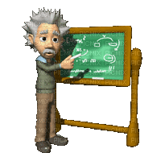

# ☄️ Scientific Conference COC 

🤓This was my first ever project, designed while in high school!

🚀The first version was made in my second year, for the scool anual scientific conference. The goal was to count how many people have visited a student presentation.

💸The website worked so well, that in my third year the school paid me to develop this simpler and more efficient version, to use every year!

# 💻 Techniques and technologies used

- 
- 
- 
- 
- 
- 
- 
- 
